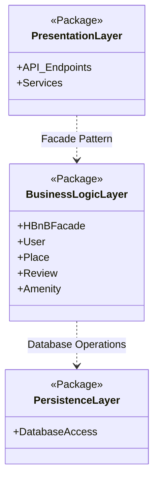
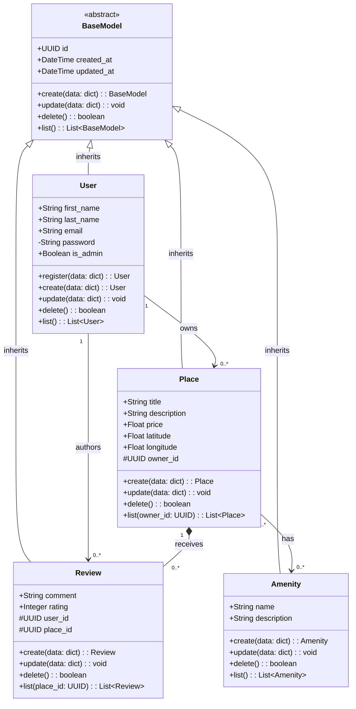
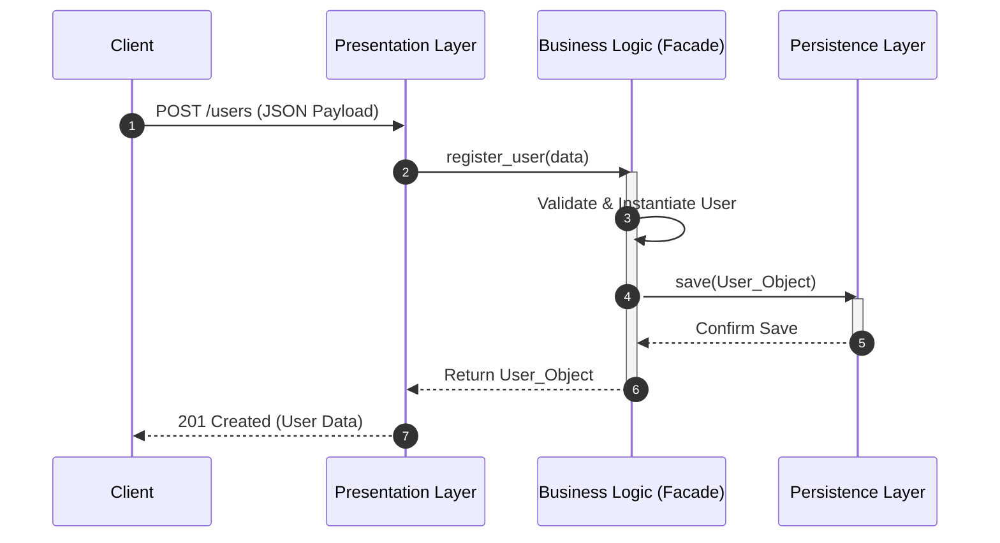
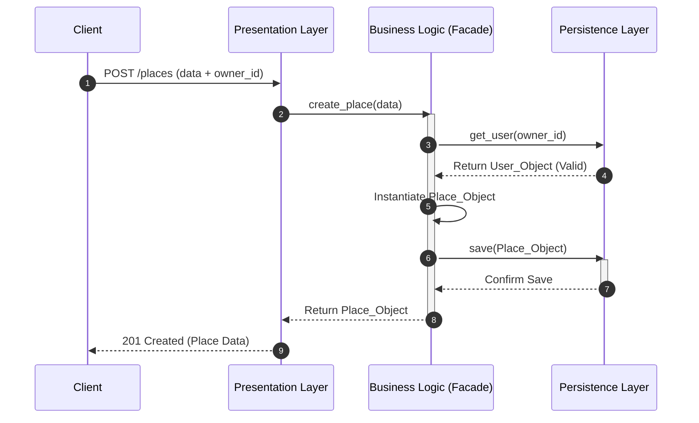
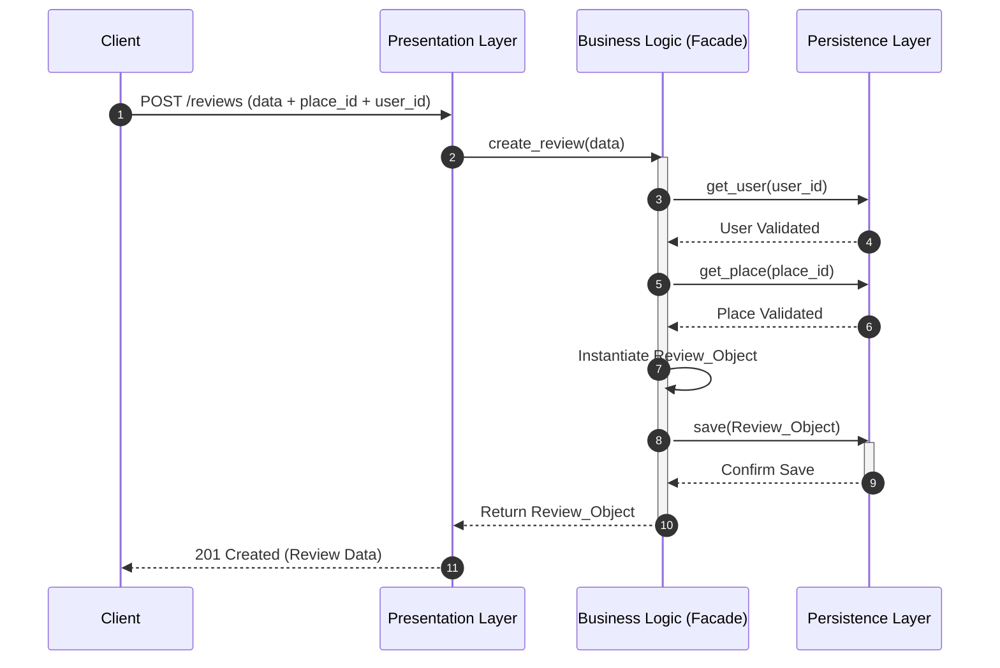
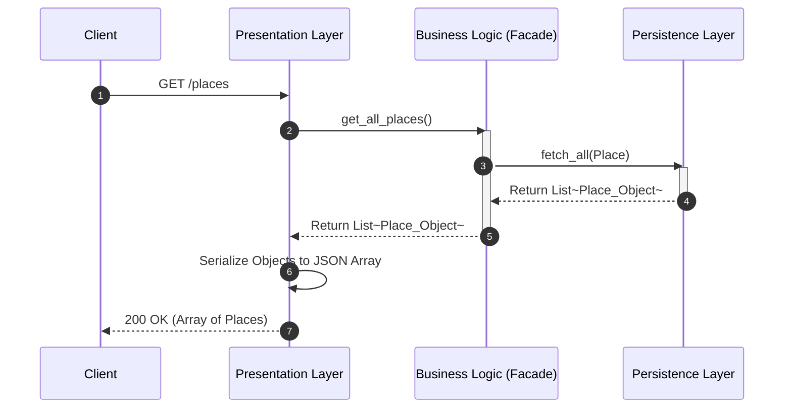

# HBnB Evolution - Part 1: Technical Documentation

**Team:** Alanoud Aloraydi, Leen Algraawi, Reema Alshahrani  
**Project:** HBnB Evolution (Part 1)  

---

## 1. Project Overview
This repository contains Part 1 of the HBnB Evolution project. This initial phase is dedicated entirely to designing the software architecture, conceptualizing the package structure, and creating the technical documentation required before implementation.

---

## 2. High-Level Architecture & Package Diagram
The HBnB Evolution system utilizes a **three-tier layered architecture** to ensure a clean separation of concerns and system modularity.

### I. Presentation Layer
Acts as the system’s interface, managing all external communication.

Responsibility: Handles HTTP requests, validates incoming data, and formats outgoing JSON responses with appropriate HTTP status codes.

### II. Business Logic Layer
Serves as the core processing engine, housing all application rules.

Responsibility: Orchestrates system behavior via the HBnBFacade, which provides a unified entry point. It manages domain entities (User, Place, Review, Amenity) and enforces business constraints independent of the interface or database.

### III. Persistence Layer
Manages the interaction between the application and the data storage system.

Responsibility: Executes all read/write operations. By abstracting the storage mechanism, it allows the system to switch storage technologies without affecting the upper layers.

---

## 3. Business Logic Layer
This layer defines the core entities of the application, isolating pure domain state and behavior from the underlying infrastructure, API routes, or persistence frameworks.

### I. Detailed Class Diagram

### II. Detailed Entity Analysis & Architectural Roles

**BaseModel**
Provides the mandatory core identity framework (id, created_at, updated_at) shared globally across the domain lifecycle.

**User Entity**
Manages system actors, handling credentials, demographic profiles, and roles (is_admin) required for ecosystem security.

**Place Entity**
Acts as the central business node, encapsulating physical property specifications, pricing structures, and host relationships.

**Review Entity**
Tracks transactional customer feedback, processing quantitative scales and comments tied to listing performances.

**Amenity Entity**
Serves as a global feature catalog linked across properties to maintain clean entity definitions.

### III. Advanced Relationship Dynamics & Multiplicity

**Generalization and Inheritance**
Enforces structural uniformity across User, Place, Review, and Amenity via the abstract BaseModel, avoiding boilerplate model properties.

**User to Place Association**
A 1 to 0..* relationship confirming that every listing requires an explicit host node, while a user can manage multiple listings.

**User to Review Association**
A 1 to 0..* unidirectional relationship ensuring strict accountability by mapping every feedback record to a validated user.

**Place to Review Composition**
A 1 to 0..* cascading lifecycle composition (*--). Reviews are structurally dependent on the target property; purging a Place cascades to clear all its feedback records.

**Place to Amenity Association**
A 0..* to 0..* mapping, providing the flexibility to load diverse utility catalogs on individual properties without duplicating metadata.

### IV. Design Decisions & OOP Compliance (SOLID Principles)

**Single Responsibility Principle (SRP)**
Domain tasks are tightly scoped per entity; Place exclusively tracks property attributes, leaving identity context to User and rating metrics to Review.

**Open/Closed Principle (OCP)**
The schema relies on BaseModel scaling, allowing the future addition of domain models (e.g., Bookings) without refactoring existing codebase configurations.

**Encapsulation**
Establishes clear visibility boundaries, restricting transactional entity tokens and sensitive operations from external layer modifications.

--- 

## 4. API Interaction Flow (Sequence Diagrams)
The following diagrams illustrate the Request Lifecycle across the application's layers for core operations.

**Business Logic Layer:** Encapsulates the core domain models and business rules.

**Persistence Layer:** Manages data storage and retrieval abstractions.

**Design Decisions & Rationale:** We implemented the Facade Pattern (HBnBFacade) to act as a unified interface between the Presentation and Business layers. This decision decouples the API from the complex internal subsystem logic, making the system easier to maintain and test.

### I. User Registration
Flow Explanation: The client sends a JSON payload. The HBnBFacade validates the data, instantiates the User object, and delegates the storage to the Persistence layer. A successful save returns the user representation.

### II. Place Creation
Flow Explanation: Place creation demands foreign key validation. The Facade ensures the owner_id correlates to a valid existing User before persisting the new Place, maintaining strict Data Integrity.

### III. Review Submission
Flow Explanation: Reviews require dual validation. The Facade verifies both the user_id and place_id exist in the database before constructing the Review object and storing it.

### IV. Fetching a List of Places
Flow Explanation: A pure Read Operation. The API requests a list; the Facade retrieves all place entities from the database, which are then serialized into a JSON array by the Presentation layer.

