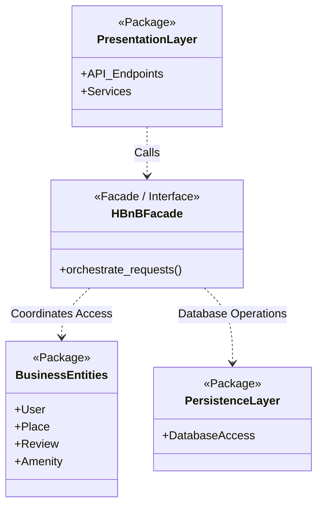
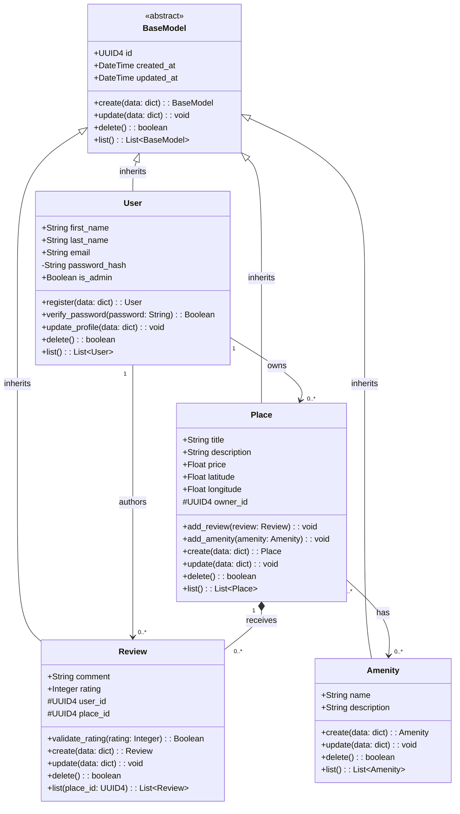
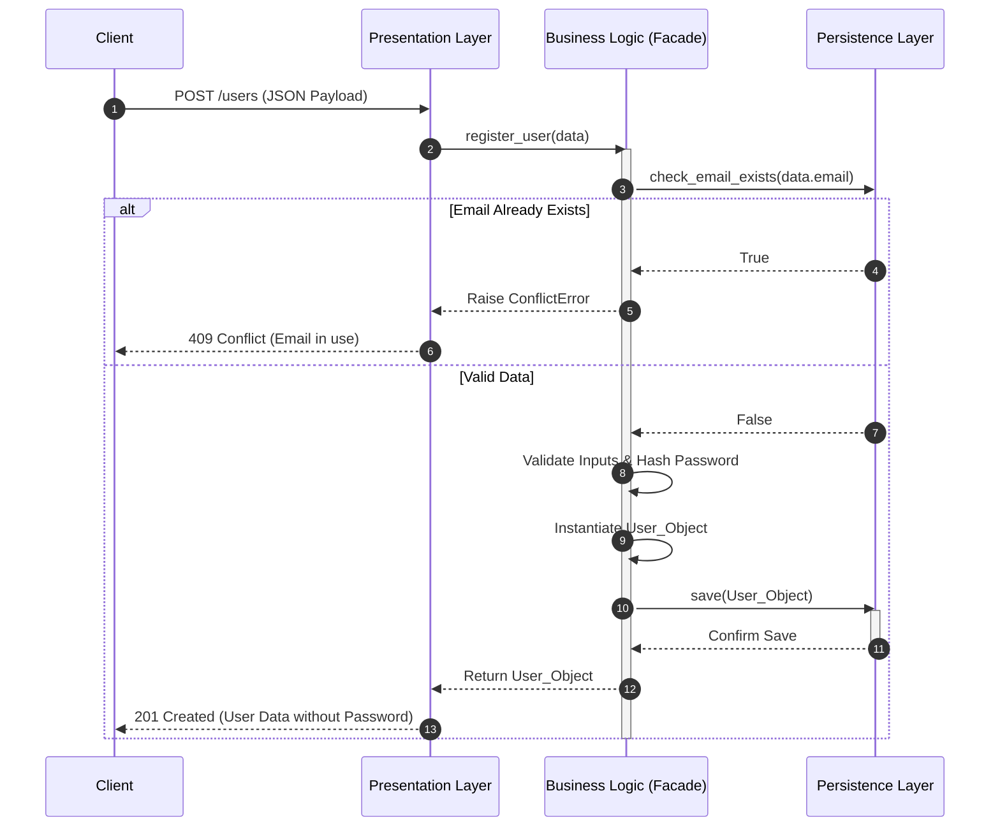
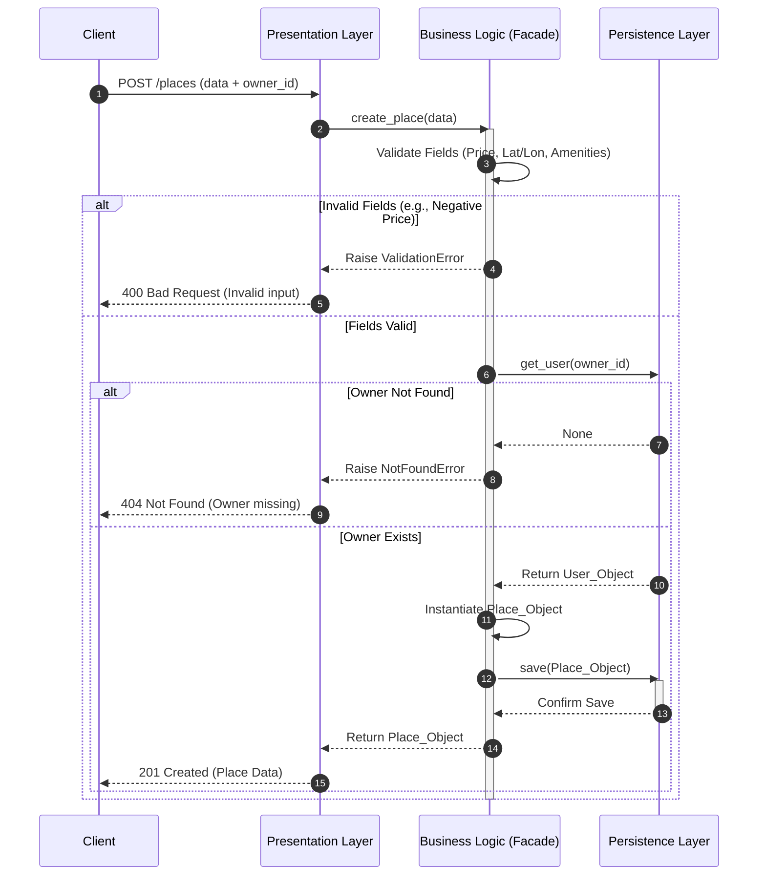
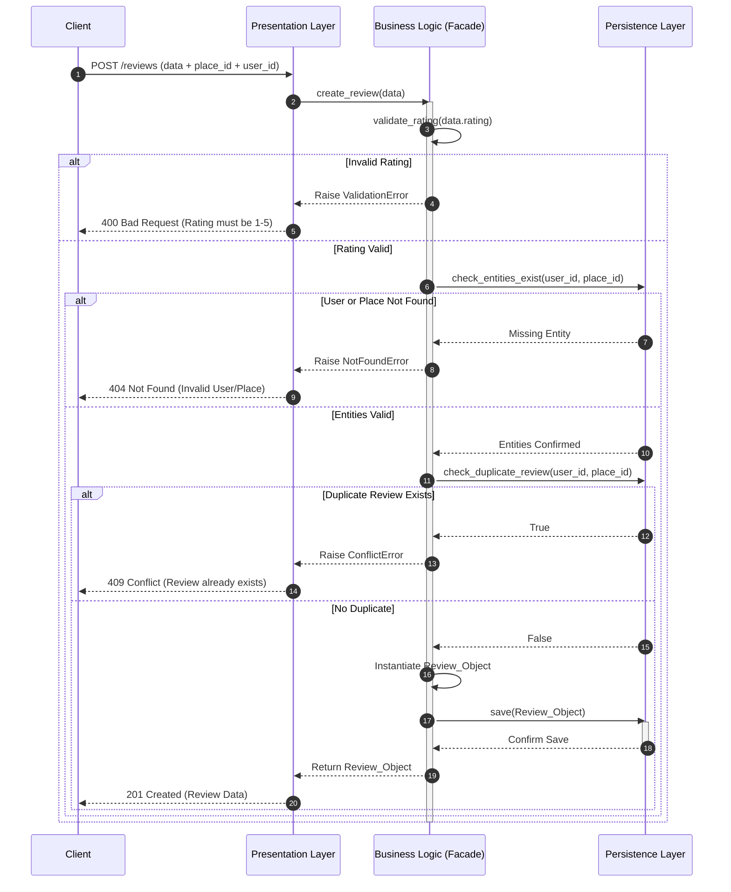
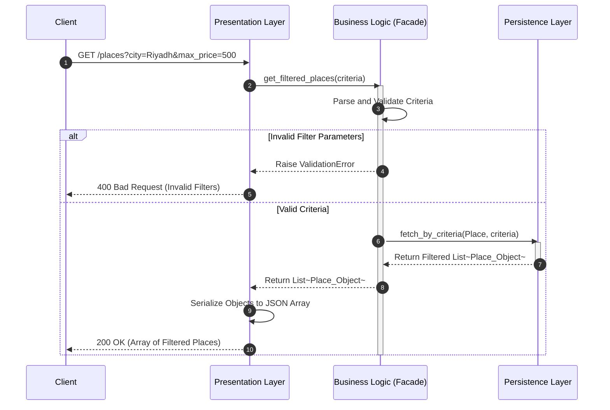

# HBnB Evolution - Part 1: Technical Documentation

**Team:** Alanoud Aloraydi, Leen Algraawi, Reema Alshahrani  
**Project:** HBnB Evolution (Part 1)  

---

## 1. Project Overview
This repository contains Part 1 of the HBnB Evolution project. This initial phase is dedicated entirely to designing the software architecture, conceptualizing the package structure, and creating the technical documentation required before implementation.

---

## 2. High-Level Architecture & Package Diagram
The HBnB Evolution system utilizes a **three-tier layered architecture** to ensure a clean separation of concerns and system modularity.

### I. Presentation Layer
Acts as the system’s interface, managing all external communication.

Responsibility: Handles HTTP requests, validates incoming data, and formats outgoing JSON responses with appropriate HTTP status codes.

### II. Business Logic Layer
Serves as the core processing engine, housing all application rules and domain entities (User, Place, Review, Amenity).

Responsibility: Orchestrates system behavior independent of the interface or database. It is accessed exclusively via the HBnBFacade, which acts as a mediator providing a unified entry point and coordinating all access to the business entities.

### III. Persistence Layer
Manages the interaction between the application and the data storage system.

Responsibility: Executes all read/write operations. By abstracting the storage mechanism, it allows the system to switch storage technologies without affecting the upper layers.

---

## 3. Business Logic Layer
This layer defines the core entities of the application, isolating pure domain state and behavior from the underlying infrastructure, API routes, or persistence frameworks.

### I. Detailed Class Diagram

### II. Detailed Entity Analysis & Architectural Roles

**BaseModel:** Provides core identity framework using UUID4, created_at, and updated_at timestamps.

**User Entity:** Manages actors and profiles. It secures credentials via password_hash and handles domain behaviors like verify_password().

**Place Entity:** The core property node (specs, price, owner_id). It actively manages state via methods like add_review().

**Review Entity:** Tracks customer feedback. It enforces rules using methods like validate_rating().

**Amenity Entity:** A global feature catalog linked across properties to enrich details.

### III. Advanced Relationship Dynamics & Multiplicity

**Inheritance:** All entities inherit BaseModel to prevent code duplication.

**User to Place (1 to 0..*):** A user can host multiple listings.

**User to Review (1 to 0..*):** Unidirectional mapping ensuring every review is tied to a valid user.

**Place to Review (1 to 0.. Composition):* ** Cascading deletion (*--); reviews are destroyed if the target Place is deleted.

**Place to Amenity (0.. to 0..*):* ** Many-to-many mapping for flexible utility catalogs.

### IV. Design Decisions (SOLID)

**SRP (Single Responsibility Principle):** Each entity manages only its specific domain (e.g., Place for property specs, Review for metrics).

**OCP (Open/Closed Principle):** Easily extensible for future models without breaking existing code.

### Encapsulation: Protects sensitive data (like password_hash) and internal states from external interference.
--- 

## 4. API Interaction Flow (Sequence Diagrams)
The following diagrams illustrate the Request Lifecycle across the application's layers for core operations, including both successful executions (Happy Paths) and failure scenarios (Error Flows) using alt blocks.

**Business Logic Layer:** Encapsulates the core domain models, executes validations, and enforces business constraints.

**Persistence Layer:** Manages data storage and retrieval abstractions.

**Design Decisions & Rationale:** We implemented the Facade Pattern (HBnBFacade) to act as a unified interface between the Presentation and Business layers. This decision decouples the API from the complex internal subsystem logic and explicitly handles validation errors before they reach the database.

### I. User Registration
Flow Explanation: The client sends a JSON payload. The HBnBFacade first checks if the email already exists to prevent duplicates. If valid, it hashes the password for security, instantiates the User object, and delegates storage to the DB. If validation fails, it immediately returns a 400 or 409 error.

### II. Place Creation
Flow Explanation: Place creation demands strict validation of fields (price, latitude, longitude, amenities) and foreign key integrity. The Facade ensures the owner_id correlates to a valid existing User. If any validation fails or the owner is missing, the flow aborts with an appropriate HTTP error.

### III. Review Submission
Flow Explanation: Reviews require multifaceted validation. The Facade verifies the rating constraints (e.g., 1-5 stars), ensures both the user_id and place_id exist, and crucially checks for duplicate reviews to prevent spam. All these constraints must be met before persisting the new record.

### IV. Fetching a List of Places (With Filters)
Flow Explanation: A Read Operation based on specific search criteria (e.g., city, max_price). The API parses the query parameters and passes them to the Facade, which dynamically constructs a filtered lookup via the Persistence layer.

