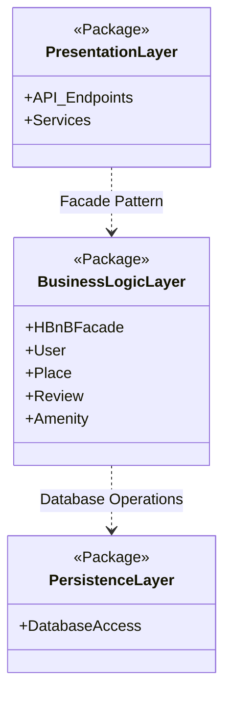

# HBnB Evolution - Part 1: Technical Documentation

**Team:** Alanoud Khalid Aloraydi, Leen Algraawi, Alshahrani Reema  
**Project:** HBnB Evolution (Part 1)  

---

## 1. Project Overview
This repository contains Part 1 of the HBnB Evolution project. This initial phase is dedicated entirely to designing the software architecture, conceptualizing the package structure, and creating the technical documentation required before implementation.

---

## 2. High-Level Architecture & Package Structure
The system is designed following the **Layered Architecture Pattern** to ensure a strict separation of concerns.

### 2.1 Package Diagram

###Explanatory Notes:

Purpose of the Diagram: To illustrate the overarching 3-tier architecture of the HBnB application and how different packages interact.

Key Components Involved: * Presentation Layer: Handles incoming HTTP requests, routing, and JSON serialization.

Business Logic Layer: Encapsulates the core domain models and business rules.

Persistence Layer: Manages data storage and retrieval abstractions.

Design Decisions & Rationale: We implemented the Facade Pattern (HBnBFacade) to act as a unified interface between the Presentation and Business layers. This decision decouples the API from the complex internal subsystem logic, making the system easier to maintain and test.
