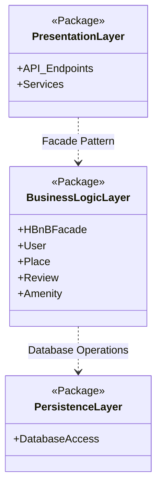
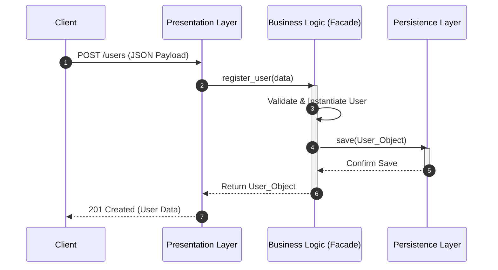
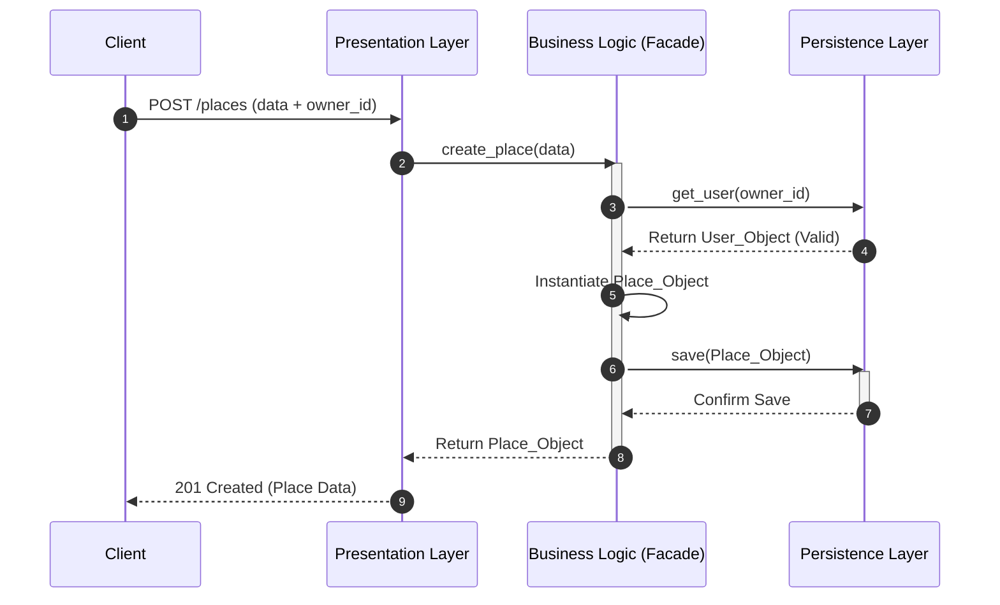
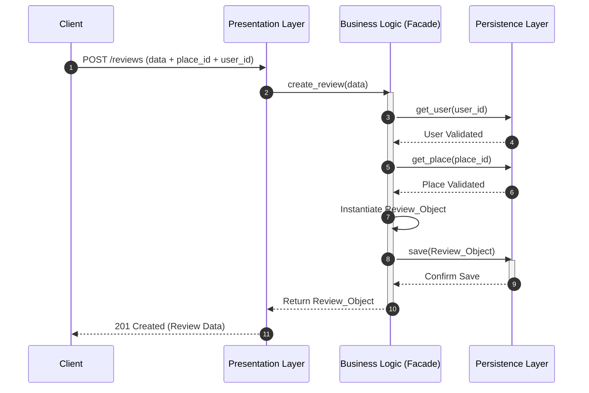
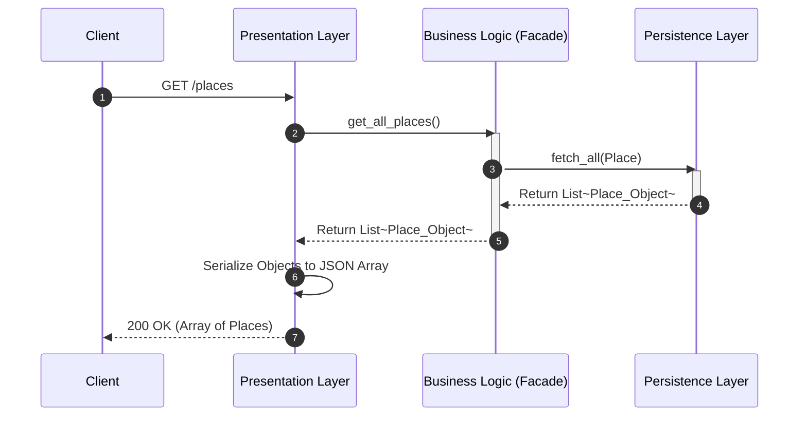

# HBnB Evolution - Part 1: Technical Documentation

**Team:** Alanoud Aloraydi, Leen Algraawi, Alshahrani Reema  
**Project:** HBnB Evolution (Part 1)  

---

## 1. Project Overview
This repository contains Part 1 of the HBnB Evolution project. This initial phase is dedicated entirely to designing the software architecture, conceptualizing the package structure, and creating the technical documentation required before implementation.

---

## 2. High-Level Architecture & Package Structure
The system is designed following the **Layered Architecture Pattern** to ensure a strict separation of concerns.

### 2.1 Package Diagram

### Explanatory Notes:

Purpose of the Diagram: To illustrate the overarching 3-tier architecture of the HBnB application and how different packages interact.

Key Components Involved: * Presentation Layer: Handles incoming HTTP requests, routing, and JSON serialization.

## 4. API Interaction Flow (Sequence Diagrams)
The following diagrams illustrate the Request Lifecycle across the application's layers for core operations.

### 4.1 User Registration
Flow Explanation: The client sends a JSON payload. The HBnBFacade validates the data, instantiates the User object, and delegates the storage to the Persistence layer. A successful save returns the user representation.

### 4.2 Place Creation
Flow Explanation: Place creation demands foreign key validation. The Facade ensures the owner_id correlates to a valid existing User before persisting the new Place, maintaining strict Data Integrity.

### 4.3 Review Submission
Flow Explanation: Reviews require dual validation. The Facade verifies both the user_id and place_id exist in the database before constructing the Review object and storing it.

### 4.4 Fetching a List of Places
Flow Explanation: A pure Read Operation. The API requests a list; the Facade retrieves all place entities from the database, which are then serialized into a JSON array by the Presentation layer.

Business Logic Layer: Encapsulates the core domain models and business rules.

Persistence Layer: Manages data storage and retrieval abstractions.

Design Decisions & Rationale: We implemented the Facade Pattern (HBnBFacade) to act as a unified interface between the Presentation and Business layers. This decision decouples the API from the complex internal subsystem logic, making the system easier to maintain and test.
