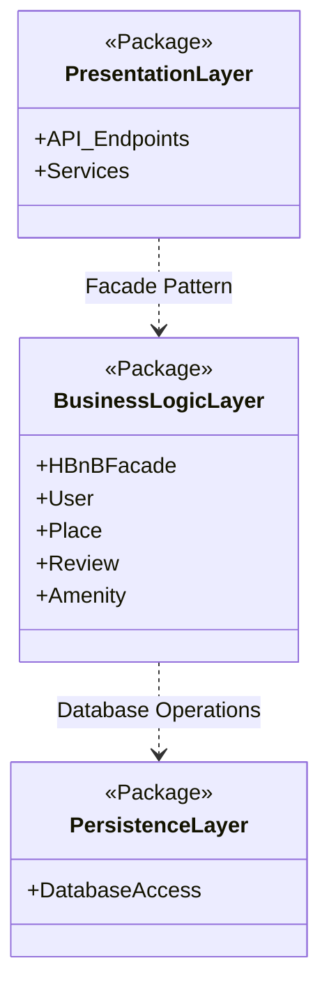
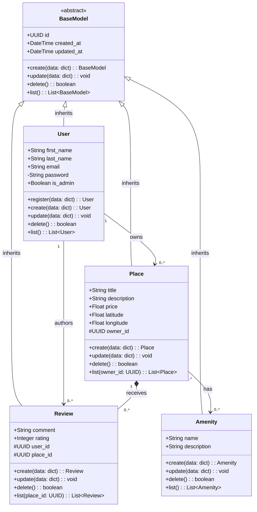
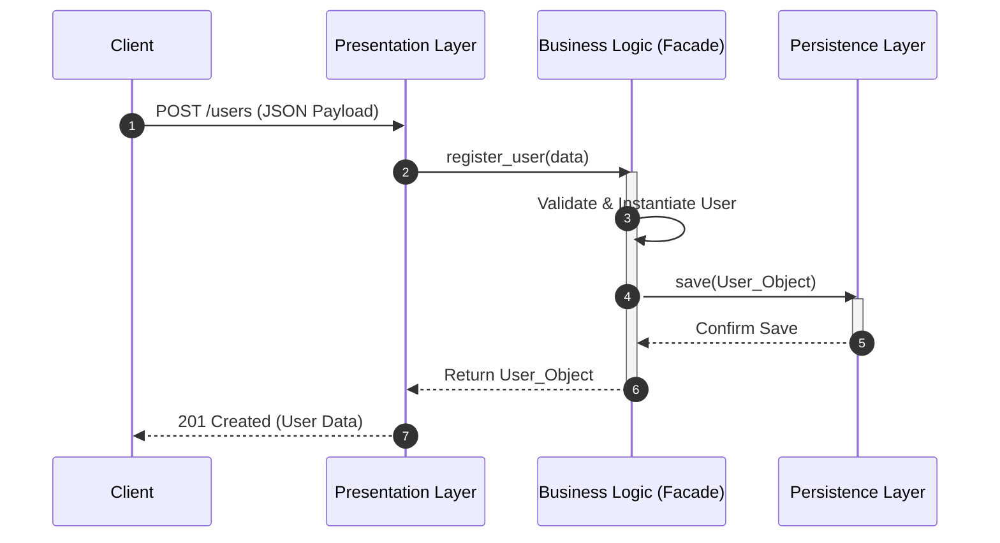
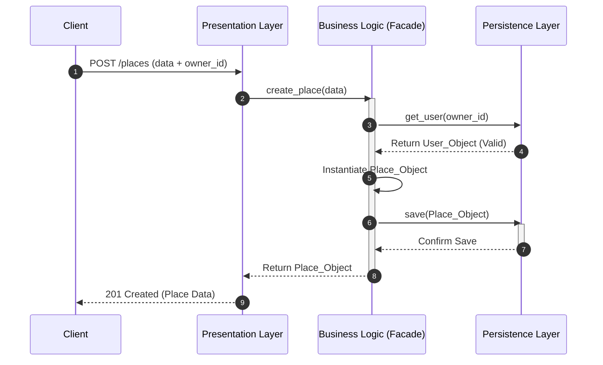
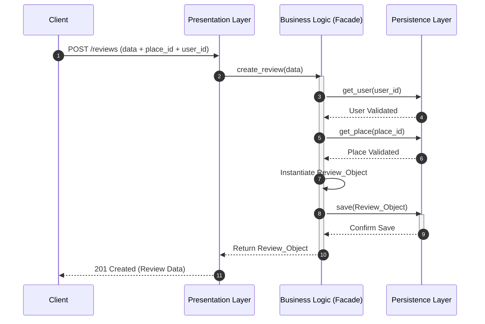
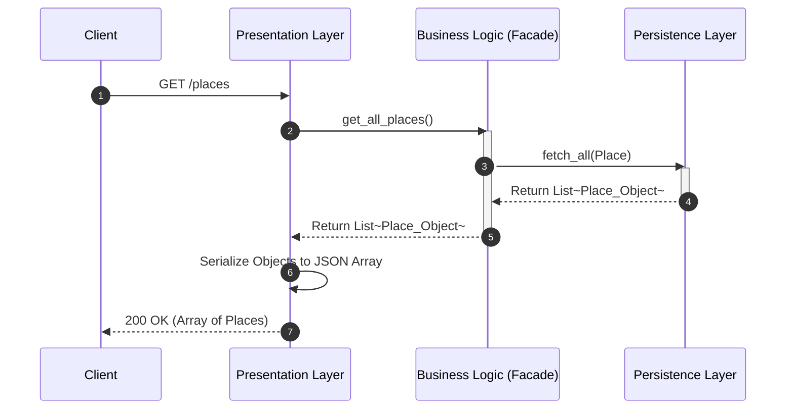

# HBnB Evolution - Part 1: Technical Documentation

**Team:** Alanoud Aloraydi, Leen Algraawi, Reema Alshahrani  
**Project:** HBnB Evolution (Part 1)  

---

## 1. Project Overview
This repository contains Part 1 of the HBnB Evolution project. This initial phase is dedicated entirely to designing the software architecture, conceptualizing the package structure, and creating the technical documentation required before implementation.

---

## 2. High-Level Architecture & Package Diagram
The HBnB Evolution system utilizes a **three-tier layered architecture** to ensure a clean separation of concerns and system modularity.

### I. Presentation Layer
Acts as the system’s interface, managing all external communication.

Responsibility: Handles HTTP requests, validates incoming data, and formats outgoing JSON responses with appropriate HTTP status codes.

### II. Business Logic Layer
Serves as the core processing engine, housing all application rules.

Responsibility: Orchestrates system behavior via the HBnBFacade, which provides a unified entry point. It manages domain entities (User, Place, Review, Amenity) and enforces business constraints independent of the interface or database.

### III. Persistence Layer
Manages the interaction between the application and the data storage system.

Responsibility: Executes all read/write operations. By abstracting the storage mechanism, it allows the system to switch storage technologies without affecting the upper layers.

## 3. Business Logic Layer
This layer defines the core entities of the application, isolating pure domain state and behavior from the underlying infrastructure, API routes, or persistence frameworks.

### I. Detailed Class Diagram

### II. Detailed Entity Analysis & Architectural Roles

**BaseModel (Abstract Class)**
Functions as the blueprint and root of the class hierarchy. It enforces cross-cutting concerns by providing a standardized identity and lifecycle tracking blueprint via a globally unique identifier (UUID) and auditing attributes (created_at, updated_at). Marking it as <<abstract>> prevents direct instantiation, guaranteeing it only serves as a reusable operational template.

**User Entity**
Captures administrative and authentication properties. It handles the mapping of user profiles, credential encapsulation (-password hidden via private visibility), and authorization through the is_admin boolean flag.

**Place Entity**
Contains the core attributes defining listed accommodations, handling critical variables like geographic coordinates (latitude, longitude) and pricing details (price). It acts as a primary transactional hub within the domain.

**Review Entity**
Handles user-generated qualitative data. It encapsulates a localized feedback mechanism (comment) and an integer rating scale (rating), capturing user opinions safely.

**Amenity Entity**
Implements a lookup-style classification structure. It stores simple metadata descriptions (name, description) describing features associated with accommodations without duplicating data across multiple listings.

### III. Advanced Relationship Dynamics & Multiplicity

**Generalization and Inheritance**
The architecture structurally implements the Don't Repeat Yourself (DRY) principle by having all core domain models inherit directly from the abstract BaseModel. This inheritance strategy guarantees that common identity elements and tracking hooks, such as unique identifiers and lifecycle audit timestamps, are centrally managed and globally consistent across the User, Place, Review, and Amenity entities without rewriting boilerplate code.

**User to Place Association**
The structural relationship between the User and Place entities is mapped using a strict one-to-many cardinality rule. Under this design rule, every listed accommodation must resolve and link back to exactly one dedicated creator or host account, whereas an individual user is permitted to hold, manage, and list anywhere from zero to an infinite number of properties within the ecosystem.

**User to Review Association**
Accountability across customer feedback loops is enforced by establishing a one-to-many directional mapping between users and reviews. This constraint dictates that anonymous or detached reviews are structurally impossible since every feedback entry must explicitly reference a single author entity, while still granting any individual user the freedom to write multiple independent reviews.

**Place to Review Composition**
The lifecycle of feedback relies on a strong composition connection between the Place and Review components. This relationship institutes a strict lifetime dependency chain where a review cannot exist without its parent accommodation listing. If a specific property is purged or deleted from the system, the application triggers a cascading deletion that automatically drops all child review nodes to maintain clean data layers.

**Place to Amenity Association**
Descriptive property tags are decoupled using a many-to-many association network between places and amenities. This structural layout provides maximum operational flexibility, enabling a single accommodation listing to gather and display an array of distinct amenities, while allowing a single amenity instance to safely interface with thousands of properties simultaneously.

### IV. Design Decisions & OOP Compliance (SOLID Principles)

**Single Responsibility Principle**
Every model within the business logic boundary is dedicated to tracking exactly one standalone area of the domain. The Place class, for example, encapsulates attributes concerning the actual property dimensions and pricing metrics, deliberately leaving author tracing rules to the User model and rating analytics to the Review class.

**Open and Closed Principle**
Future platform enhancements are decoupled by scaling through the abstract BaseModel. If incoming system updates demand adding entirely new business entities, developers can drop in those new classes as extensions of the BaseModel without altering or risking regressions in existing codebase files.

**Data Encapsulation and Access Control**
Internal fields are actively shielded using visibility modifiers to establish robust boundary control. High-security properties, such as user login credentials, utilize private visibility settings, while contextual structural references, including host and location foreign keys, adopt protected access levels to isolate operations from unverified external changes.

--- 

## 4. API Interaction Flow (Sequence Diagrams)
The following diagrams illustrate the Request Lifecycle across the application's layers for core operations.

**Business Logic Layer:** Encapsulates the core domain models and business rules.

**Persistence Layer:** Manages data storage and retrieval abstractions.

**Design Decisions & Rationale:** We implemented the Facade Pattern (HBnBFacade) to act as a unified interface between the Presentation and Business layers. This decision decouples the API from the complex internal subsystem logic, making the system easier to maintain and test.

### I. User Registration
Flow Explanation: The client sends a JSON payload. The HBnBFacade validates the data, instantiates the User object, and delegates the storage to the Persistence layer. A successful save returns the user representation.

### II. Place Creation
Flow Explanation: Place creation demands foreign key validation. The Facade ensures the owner_id correlates to a valid existing User before persisting the new Place, maintaining strict Data Integrity.

### III. Review Submission
Flow Explanation: Reviews require dual validation. The Facade verifies both the user_id and place_id exist in the database before constructing the Review object and storing it.

### IV. Fetching a List of Places
Flow Explanation: A pure Read Operation. The API requests a list; the Facade retrieves all place entities from the database, which are then serialized into a JSON array by the Presentation layer.

