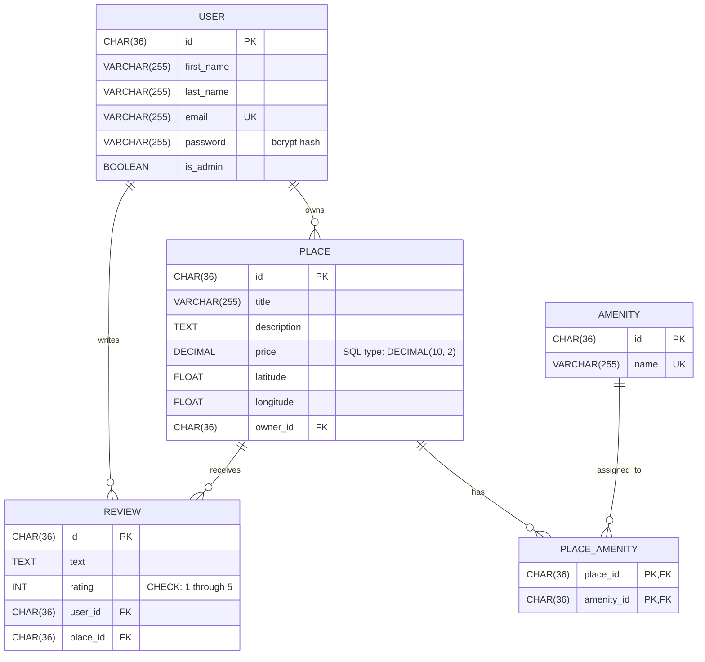

# HBnB Task 10 Database ER Diagram

This Task 10 diagram represents the raw SQLite schema defined by
`sql/schema.sql` for Task 9. It intentionally excludes fields and behavior that
exist only in the SQLAlchemy mappings.

## Mermaid source

## Exported SVG

## Entity summary

- `USER` stores account identity, contact data, the administrator flag, and a
  bcrypt password hash rather than plaintext.
- `PLACE` stores listing details and identifies its owner.
- `REVIEW` stores a rating and text written by a User for a Place.
- `AMENITY` stores the unique names of features available at Places.
- `PLACE_AMENITY` is the join entity connecting Places and Amenities.

## Relationship summary

The cardinalities represent the intended HBnB domain relationships. The raw
Task 9 SQL does not explicitly declare its foreign-key columns as `NOT NULL`.

- One User owns zero or many Places; each Place references one User.
- One User writes zero or many Reviews; each Review references one User.
- One Place receives zero or many Reviews; each Review references one Place.
- A Place and an Amenity participate in a many-to-many relationship through
  `PLACE_AMENITY`. Every join row references one Place and one Amenity.

## Constraint summary

- `USER.email` is unique.
- `AMENITY.name` is unique.
- `REVIEW.rating` is restricted to values from `1` through `5`.
- The pair `(REVIEW.user_id, REVIEW.place_id)` is unique. Neither foreign key
  is individually unique.
- `(PLACE_AMENITY.place_id, PLACE_AMENITY.amenity_id)` is one composite primary
  key, and both columns are also foreign keys.

## Difference from the ORM

The diagram follows the explicit Task 9 raw SQL schema. The current ORM also
defines inherited timestamps, different string lengths, an Amenity description,
non-null mappings, Python-side defaults, and relationship cascade behavior.
Those ORM-only details are not part of this diagram.

A Reservation or Booking entity would be a possible future conceptual
extension, but neither is implemented in the current Task 9 schema.
