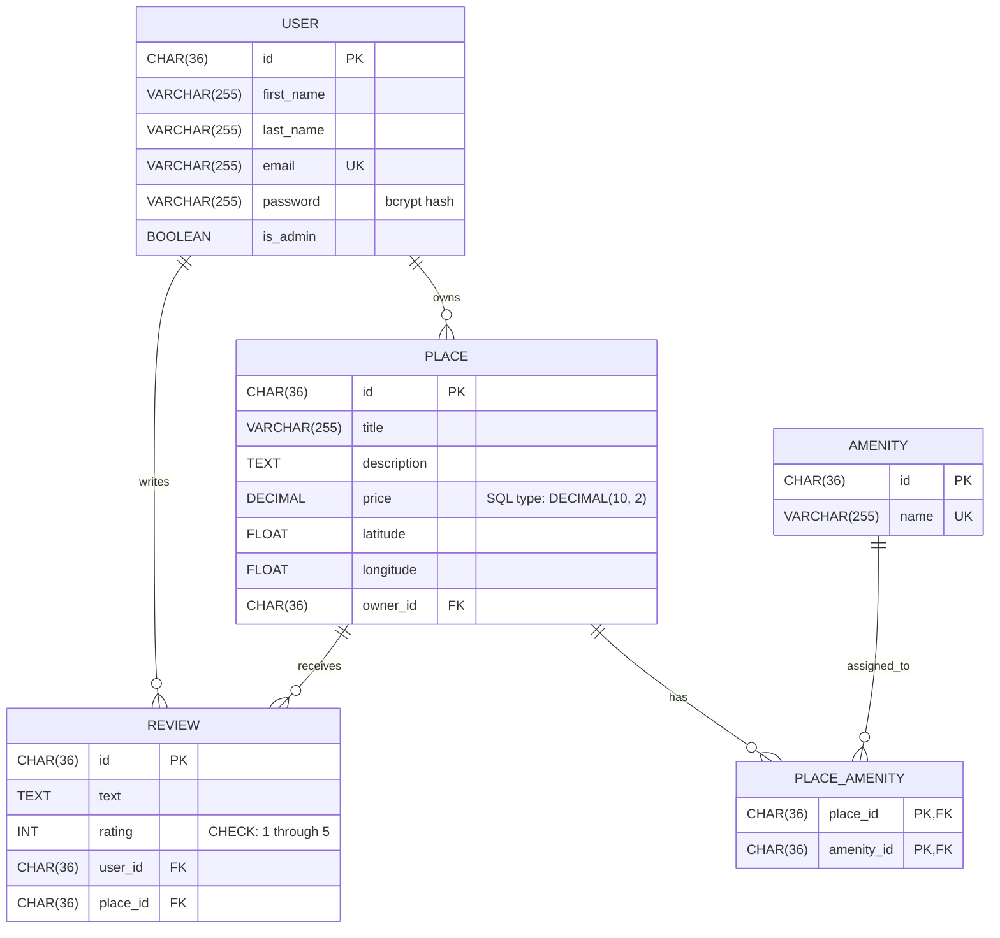

# HBnB - Holberton BnB

A layered Flask backend for an AirBnB-style platform: a REST API backed by JWT authentication, role-based access control, and SQLAlchemy/SQLite persistence.

## Architecture

- **`app/api/v1/`** — REST endpoints (Flask-RESTx) for users, places, reviews, amenities, and login.
- **`app/models/`** — Domain classes (`User`, `Place`, `Review`, `Amenity`) with validation rules.
- **`app/services/facade.py`** — `HBnBFacade`, the single point of contact between the API and the models/persistence layers.
- **`app/persistence/`** — `SQLAlchemyRepository`, one per entity, implementing a common `Repository` interface.

```
part3/
├── app/
│   ├── api/v1/        # users, places, reviews, amenities, auth
│   ├── models/         # domain classes + validation
│   ├── services/        # facade + repositories
│   └── persistence/     # repository interface + SQLAlchemy implementation
├── sql/                 # raw SQL schema, seed data, CRUD demo
├── tests/
├── run.py
├── config.py
└── requirements.txt
```

## Authentication and Authorization

- Passwords are hashed with bcrypt (`User.hash_password`) and never appear in any API response.
- `POST /api/v1/auth/login` checks credentials and returns a JWT (Flask-JWT-Extended) carrying the user's id and an `is_admin` claim.
- Protected endpoints require that JWT. Creating, updating, and deleting a place or review additionally requires owning it — with two extra rules for reviews: you cannot review your own place, and you cannot review the same place twice.
- Admins bypass all ownership checks, and are the only ones who can create users, change another user's email/password/admin flag, or create and modify amenities.
- Reading data (listing/getting places, reviews, and amenities) stays public, no token required.

## Running Locally

```bash
python3 -m venv venv && source venv/bin/activate   # Windows: venv\Scripts\activate
pip install -r requirements.txt
python run.py
```

Swagger UI is served at `/api/v1/`.

**Requirements:** Python 3.x, Flask, Flask-RESTx, Flask-Bcrypt, Flask-JWT-Extended, Flask-SQLAlchemy.

## Raw SQL Scripts

`sql/` defines the schema and seed data directly in SQL, independent of SQLAlchemy:

- `schema.sql` — the five tables and their constraints.
- `seed.sql` — the fixed administrator and three required amenities.
- `crud_test.sql` — a CRUD demonstration that rolls back its own changes.

The administrator's id is fixed by the assignment; the password column stores only its bcrypt hash. From `part3/`, try it against a throwaway database:

```powershell
python -c "import sqlite3; conn=sqlite3.connect('test.db'); conn.executescript(open('sql/schema.sql', encoding='utf-8').read()); conn.executescript(open('sql/seed.sql', encoding='utf-8').read()); conn.executescript(open('sql/crud_test.sql', encoding='utf-8').read()); conn.close()"
Remove-Item test.db
```

The raw schema follows the assignment's SQL definitions as given, so it's intentionally simpler than the SQLAlchemy mapping (no timestamps, shorter strings, no Amenity description, no ORM cascades).

## Database Diagram



This mirrors the raw SQL schema above, not the richer SQLAlchemy mapping. Key constraints: `USER.email` and `AMENITY.name` are unique; `REVIEW.rating` is 1–5; the pair `(REVIEW.user_id, REVIEW.place_id)` is unique (one review per user per place); `PLACE_AMENITY` has a composite primary key `(place_id, amenity_id)`.

To edit it, copy the block above into the [Mermaid Live Editor](https://mermaid.live).

## Testing

```bash
python -m unittest discover -s tests -v
```

129 tests in total: 53 carried over from the in-memory API, 76 covering this part (18 of those specifically exercise the raw SQL scripts above).

## Author

*Alanoud Aloraydi, Leen Algraawi, Reema Alshahrani.*
